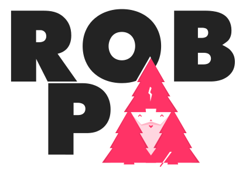

Brewser.js is an open source JavaScript device and browser detection library. The main goal of this project is to offer Front-end developers a straightforward way to detect different (mobile/tablet/desktop) device types in JavaScript, and to help them to detect their users' browser capabilities.

Brewser.js utilises a mixture of JavaScript and CSS property and capability checks, and it uses the UserAgent string to gather information about the device and the browswer.

The library also offers some shortcuts to often used device and browser parameters - such as screen size, window size, screen pixel density and device orientation.

For the full list of goodies brewser.js has to offer, please check out [this demo](https://robpataki.github.io/brewser/).

## Installation

### NPM

    $ npm install brewser

### Bower

    $ bower install brewser

## Demos

### Live demo

[https://robpataki.github.io/brewser/](https://robpataki.github.io/brewser/)

### Offline demo

See `demo` folder in the project's root folder.

## Contribution

The library of course is far from perfect, we are more than happy to take contributions and suggestions on board! Should you have a bugfix or a feature request, please make a pull request or rase an issue here on Github!

### Release updated version of brewser.js

Please note, that the version number in `version.json` overrides the version numbers both in `package.json` and `bower.json`. Make sure you bump up the version number in `version.json` before release!

Once you're happy with your changes, run

    $ gulp release

Then commit your changes, push them up and tag the new release:

    $ git tag -a v0.0.2 -m "Version 0.0.2 release"
    $ git push origin master --tags
    $ npm publish

You're done, let's see that pull request!

## Licence

GPL - 2017

Copyright &copy; 2024 <a href="https://github.com/robpataki/brewser" >brewser.js</a> was created and has been maintained by [Rob Pataki](https://github.com/robpataki) since 2015. Brewser logo design by [Gabor Tatrai](http://gabor.tatrai.com/).
